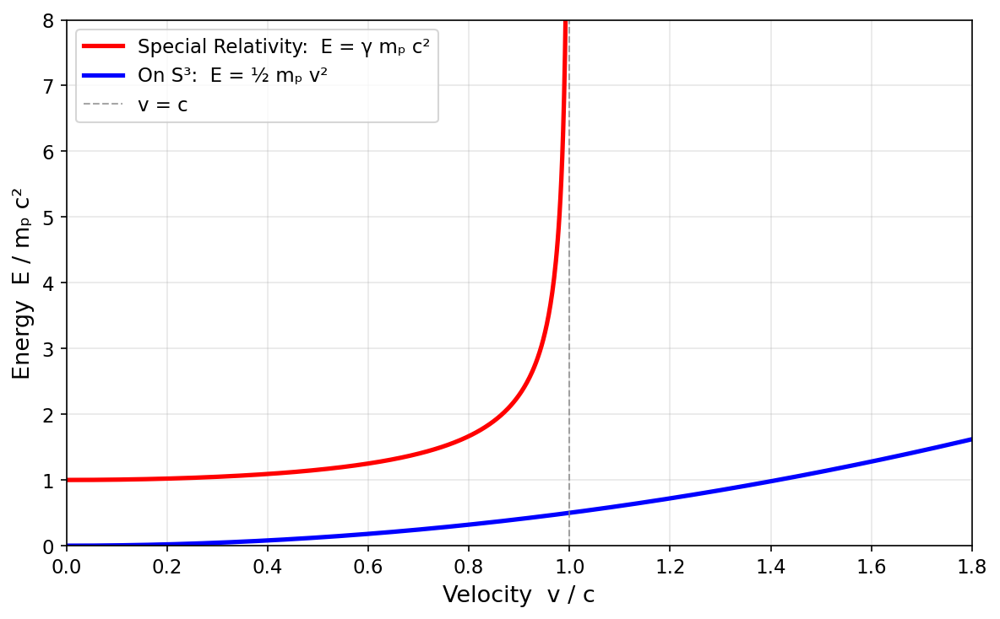

# Spacetime Theory

### *Empathy with the Universe*

by *Norbert Nopper*

- [Quaternion-Hypersphere Theory](README.md)
- [What is Time?](WhatIsTime.md)
- **[Faster Than Light](#faster-than-light-)**
- [Outlook](Outlook.md)
- [Summary](Summary.md)

## Faster Than Light 🚀💫

### *Retraction: the speed of light is a fundamental limit*

> **Note.** An earlier version of this theory argued that the Euclidean signature $(+,+,+,+)$ on the hypersphere removes the Lorentz factor and therefore permits faster-than-light travel. That claim is **retracted**. The adopted framework uses a Lorentzian signature (see [Foundations](README.md#foundations)); Special Relativity is built into the theory, and $c$ is a true kinematic limit. This page explains why the earlier argument fails and why the limit is unavoidable.

## The Light Speed Barrier in Special Relativity

In Einstein's Special Relativity, the Minkowski signature $(-,+,+,+)$ produces the Lorentz factor:

$$\gamma = \frac{1}{\sqrt{1 - \dfrac{v^2}{c^2}}}$$

As $v \to c$, $\gamma \to \infty$ and the relativistic energy

$$E = \gamma m_p c^2$$

diverges. Accelerating a massive object to the speed of light requires infinite energy — an absolute barrier.

## Why the same barrier applies here

This theory adopts the Lorentzian metric (see [Foundations](README.md#foundations))

$$ds^2 = -c^2\, d\tau^2 + ds^2_{S^3_R}$$

on the foliated manifold $\mathcal{M} = \mathbb{R}_\tau \times S^3_{R(\tau)}$. The four quaternion components $(\xi, x, y, z)$ are all **spatial**; cosmic time $\tau$ is a separate, Lorentzian, coordinate. Along any worldline, proper time satisfies

$$d\tau_{\text{proper}}^2 = d\tau^2 - \frac{ds^2_{S^3_R}}{c^2}, \qquad \frac{d\tau_{\text{proper}}}{d\tau} = \sqrt{1 - \frac{v^2}{c^2}}$$

with $v = |ds_{S^3}/d\tau|$ the arc speed on the spatial sphere. The Lorentz factor $\gamma$ reappears with all of its standard consequences: infinite energy at $v \to c$, time dilation, length contraction, causal light cones.

## Where the earlier argument broke down

The earlier argument placed the component $ct$ *inside* the quaternion and used the Euclidean norm $c^2t^2 + x^2 + y^2 + z^2 = R^2$ as a constraint on events. This has two fatal problems:

1. **It contradicts observed time dilation.** A Euclidean 4D metric gives proper time $d\lambda^2 = dt^2 + (1/c^2)\, d\mathbf{x}^2$, i.e. moving clocks would tick *faster*, not slower, than stationary ones. Every particle accelerator and every muon lifetime measurement says the opposite.
2. **There is no light cone.** Without a distinction between timelike and spacelike directions, the notion of "signal propagation speed" is not well-defined, so neither is the question of whether something "beats" light.

The Lorentzian foliation adopted in [Foundations](README.md#foundations) fixes both. The quaternion now describes only the *spatial* geometry (it parameterizes $S^3_R$), and time is the foliation parameter $\tau$ with a genuine minus sign in the metric.

## Historical Lagrangian derivation (for context only)

The calculation below reproduces the earlier Euclidean-signature argument. It is kept here to document what the earlier version claimed and why the claim does not survive once Lorentzian signature is imposed. **The following is not the prediction of the current theory.**

*A particle of mass $m_p$ moves on $S^3$ of radius $R$. In the Euclidean setting the induced metric is*

$$ds^2 = R^2 \left[ d\chi^2 + \sin^2\chi \left( d\theta^2 + \sin^2\theta\, d\phi^2 \right) \right]$$

*and the free Lagrangian*

$$\mathcal{L} = \tfrac{1}{2} m_p R^2 \left[ \dot{\chi}^2 + \sin^2\chi \left( \dot{\theta}^2 + \sin^2\theta\, \dot{\phi}^2 \right) \right]$$

*gives the Newtonian kinetic energy $E_{\text{kin}} = \tfrac{1}{2} m_p R^2 \omega^2$, quadratic in speed, with no divergence at $v = c$. Under **Lorentzian** signature the same setup yields instead the relativistic action, whose worldline energy reproduces $E = \gamma m_p c^2$ and the standard light-speed barrier.*

The Euclidean-signature derivation is mathematically correct; it is simply not the geometry the universe realizes.

## Causality

Under Lorentzian signature, causality is the standard one: events are ordered by the light-cone structure of the metric

$$ds^2 = -c^2\, d\tau^2 + ds^2_{S^3_R}$$

A signal between two points on the same spatial leaf $S^3_{R(\tau)}$ must propagate through spacetime, accumulating $\Delta\tau > 0$ bounded below by the arc length divided by $c$. No signal crosses a leaf instantaneously, and no worldline closes in time, so causality is preserved without any appeal to the global expansion direction.

## Conclusion

What the theory permits:

- All of Special and General Relativity, including $E = \gamma m_p c^2$ and light cones.
- Cosmic expansion driven by energy-to-mass conversion, with $R(\tau) = R_{\max}(1 - e^{-c\tau/R_{\max}})$.

What the theory does **not** permit:

- Faster-than-light propulsion or signalling.
- Superluminal shortcuts through the hypersphere.
- Any violation of the standard Lorentz-invariant kinematics at the level of fundamental physics.

The price of empirical consistency (with time dilation, muon lifetimes, the whole relativistic catalogue) is that the speed of light remains what it has always been: the universal limit.

## References

- [Outlook](Outlook.md)
- [Quaternion-Hypersphere Theory of Spacetime](README.md)
- [Summary](Summary.md)
- [What is Time?](WhatIsTime.md)
- [Euler–Lagrange equation](https://en.wikipedia.org/wiki/Euler%E2%80%93Lagrange_equation)
- [Faster-than-light](https://en.wikipedia.org/wiki/Faster-than-light)
- [Geodesic](https://en.wikipedia.org/wiki/Geodesic)
- [Lagrangian mechanics](https://en.wikipedia.org/wiki/Lagrangian_mechanics)
- [Lorentz factor](https://en.wikipedia.org/wiki/Lorentz_factor)
- [Minkowski space](https://en.wikipedia.org/wiki/Minkowski_space)
- [Special relativity](https://en.wikipedia.org/wiki/Special_relativity)
