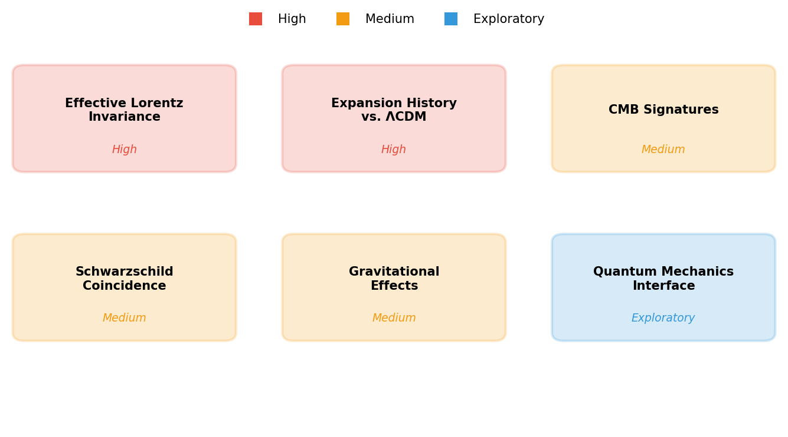

# Spacetime Theory

### *Empathy with the Universe*

by *Norbert Nopper*

- [Quaternion-Hypersphere Theory](README.md)
- [What is Time?](WhatIsTime.md)
- [Faster Than Light](FasterThanLight.md)
- **[Outlook](#outlook-)**
- [Summary](Summary.md)

## Outlook 🔭

### *Where the theory goes from here*

The Quaternion-Hypersphere Theory of Spacetime is a self-contained geometric framework: quaternion events on a foliation $\mathcal{M} = \bigcup_R S^3_R$ with Euclidean signature $(+,+,+,+)$, $R$ identified with the Schwarzschild radius of the total mass, an explicit growth law $dR/d\tau = c(1 - R/R_{\max})$, and causal ordering given by the cosmic epoch $\tau$ (see [Foundations](README.md#foundations)).

What remains open is **empirical** — whether the framework's predictions agree with observation. This document collects those empirical tests.

## Effective Lorentz Invariance

The theory uses a Euclidean signature, with Euclidean proper time along worldlines (moving observers accumulate $\lambda \geq \tau$, not $\leq \tau$). Lorentz invariance is experimentally confirmed to extraordinary precision, so any viable framework must agree with those measurements in the tested regime.

The empirical questions are:

- **Direct Lorentz-invariance tests** — Hughes–Drever experiments, modern Michelson–Morley variants, and atomic-clock comparisons constrain deviations from Lorentz symmetry to parts in $10^{-18}$ and beyond. Do the predictions of Euclidean proper time on $S^3_R$ fit within those bounds at accessible energies?
- **Particle-accelerator kinematics** — Relativistic $\gamma$ factors are measured routinely at colliders. Does the Euclidean kinetic energy $\tfrac{1}{2}m_p v^2$ derived in [Faster Than Light](FasterThanLight.md) admit a reparameterization in observer-measured quantities that reproduces the observed $E$–$p$ relation in the tested energy range?
- **Time-dilation observations** — Muon lifetimes, GPS clock corrections, and binary-pulsar timings confirm time dilation. Can the framework reproduce these numerically?

## Expansion History and Comparison with ΛCDM

The theory predicts a specific expansion history $R(\tau) = R_{\max}\bigl(1 - e^{-c\tau/R_{\max}}\bigr)$ and Hubble parameter

$$H(\tau) = \frac{c}{R}\left(1 - \frac{R}{R_{\max}}\right)$$

with no cosmological constant. The empirical questions are:

- Comparing the predicted $H(z)$ and luminosity distance $d_L(z)$ against Type Ia supernovae and BAO data
- Checking whether the single free parameter $R_{\max}$ (equivalently $E_{\text{tot}}$) can fit the observed expansion history as well as ΛCDM's two parameters ($\Omega_m$, $\Omega_\Lambda$)
- Testing whether the predicted asymptotic freeze-out ($H \to 0$ as $R \to R_{\max}$) is consistent with or distinguishable from ΛCDM's de Sitter attractor at late times

## CMB Signatures of Finite Geometry

A closed S³ geometry with finite $R_{\max}$ has observable consequences in the cosmic microwave background:

- **Suppressed large-angle correlations** — A finite universe suppresses the lowest multipoles of the CMB power spectrum. The observed anomalously low quadrupole ($\ell = 2$) may be consistent with this prediction.
- **Matched circles** — In a closed topology, the CMB sky could contain pairs of circles with matching temperature patterns. Searches have been conducted but depend on the specific topology assumed.
- **Curvature** — The spatial curvature parameter $\Omega_k$ should be slightly negative (closed geometry). Current Planck data constrain $\Omega_k$ to be very close to zero, which sets a lower bound on $R_{\max}$.

Quantifying these predictions requires specifying how the S³ geometry maps onto the observable CMB sky.

## Schwarzschild Radius Coincidence

The theory identifies $R$ with the Schwarzschild radius of the total mass:

$$R = \frac{2Gm}{c^2}$$

The observable universe has a Hubble radius of approximately $1.3 \times 10^{26}$ m. If the total mass-energy within this radius is approximately $10^{53}$ kg, the Schwarzschild radius is:

$$R_S = \frac{2 \times 6.674 \times 10^{-11} \times 10^{53}}{(3 \times 10^8)^2} \approx 1.5 \times 10^{26} \text{ m}$$

The approximate agreement is striking and has been noted in black hole cosmology models. A precise comparison requires:

- Careful accounting of total mass-energy (baryonic + dark matter + radiation equivalent)
- Clarifying whether $R$ corresponds to the Hubble radius, the particle horizon, or another cosmological scale
- Determining how $R$ evolves relative to the standard scale factor $a(t)$

## Gravitational Phenomena

The current framework describes the global geometry of the universe. Any extension to local gravity must be tested against the high-precision measurements of General Relativity:

- **Gravitational time dilation** — Pound–Rebka, GPS clock corrections, and optical-clock comparisons across gravitational potentials. Any local curvature correction to the geometric time relation $t_{\mathcal{O}} = \sqrt{R^2 - r_{\mathcal{O}}^2}/c$ must reproduce these to the measured precision.
- **Orbital mechanics** — Perihelion precession of Mercury, light bending by the Sun, Shapiro delay, and Lense–Thirring precession. The Schwarzschild and Kerr solutions describe these to extraordinary accuracy; any S³-based local description must match.
- **Gravitational waves** — LIGO/Virgo detections of binary mergers. A consistent extension of the framework must reproduce the observed waveforms.
- **Strong-field tests** — Event Horizon Telescope images, binary-pulsar timing (e.g. PSR J0737−3039), and black-hole ringdown modes.

## Summary of Empirical Tests

| Area | Predicted quantity | Observational comparison |
|------|-------------------|-------------------------|
| Lorentz invariance | Euclidean proper time on worldlines | Hughes–Drever, clock comparisons, accelerator kinematics |
| Expansion history | $H(\tau) = (c/R)(1 - R/R_{\max})$ | SN Ia, BAO, Hubble-diagram data |
| CMB signatures | Suppressed low multipoles, matched circles, small negative $\Omega_k$ | Planck CMB data |
| Schwarzschild coincidence | $R \sim 2G m_{\text{universe}}/c^2$ | Observed $m_{\text{universe}}$ and Hubble radius |
| Gravitational phenomena | Local-gravity extension of the framework | Solar-system tests, LIGO/Virgo, EHT, pulsar timing |

## References

- [Baryon acoustic oscillations](https://en.wikipedia.org/wiki/Baryon_acoustic_oscillations)
- [Cosmic microwave background](https://en.wikipedia.org/wiki/Cosmic_microwave_background)
- [Event Horizon Telescope](https://en.wikipedia.org/wiki/Event_Horizon_Telescope)
- [Friedmann equations](https://en.wikipedia.org/wiki/Friedmann_equations)
- [General relativity](https://en.wikipedia.org/wiki/General_relativity)
- [Gravitational wave](https://en.wikipedia.org/wiki/Gravitational_wave)
- [Hubble's law](https://en.wikipedia.org/wiki/Hubble%27s_law)
- [Hughes–Drever experiment](https://en.wikipedia.org/wiki/Hughes%E2%80%93Drever_experiment)
- [Kerr metric](https://en.wikipedia.org/wiki/Kerr_metric)
- [Lambda-CDM model](https://en.wikipedia.org/wiki/Lambda-CDM_model)
- [LIGO](https://en.wikipedia.org/wiki/LIGO)
- [Lorentz covariance](https://en.wikipedia.org/wiki/Lorentz_covariance)
- [Michelson–Morley experiment](https://en.wikipedia.org/wiki/Michelson%E2%80%93Morley_experiment)
- [Pound–Rebka experiment](https://en.wikipedia.org/wiki/Pound%E2%80%93Rebka_experiment)
- [Schwarzschild metric](https://en.wikipedia.org/wiki/Schwarzschild_metric)
- [Shapiro time delay](https://en.wikipedia.org/wiki/Shapiro_time_delay)
- [Type Ia supernova](https://en.wikipedia.org/wiki/Type_Ia_supernova)
