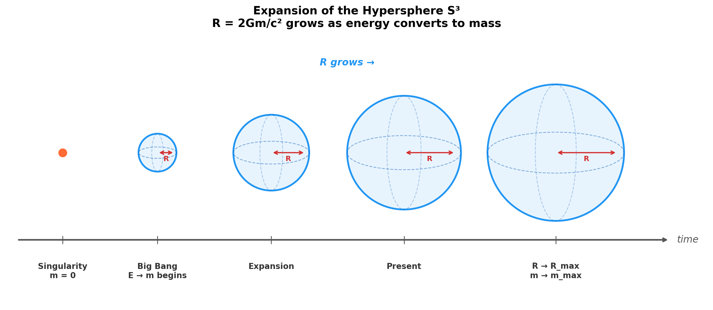

# Spacetime Theory

### *Empathy with the Universe*

by *Norbert Nopper*

- **[Quaternion-Hypersphere Theory](#quaternion-hypersphere-theory-of-spacetime-)**
- [What is Time?](WhatIsTime.md)
- [Faster Than Light](FasterThanLight.md)
- [Outlook](Outlook.md)
- [Summary](Summary.md)

## Quaternion-Hypersphere Theory of Spacetime 🌌

### *Spacetime is energy*

## Definition of a Quaternion

A quaternion is defined as:

$$q = w + p\mathbf{i} + r\mathbf{j} + s\mathbf{k}$$

where $w, p, r, s \in \mathbb{R}$ and the basis elements satisfy:

$$\mathbf{i}^2 = \mathbf{j}^2 = \mathbf{k}^2 = \mathbf{i}\mathbf{j}\mathbf{k} = -1$$

## Theory

A spacetime event is represented as a quaternion:

$$q = ct + x\mathbf{i} + y\mathbf{j} + z\mathbf{k}$$

where the components map as $w \equiv ct$, $p \equiv x$, $r \equiv y$, $s \equiv z$. Here $t$ is time, $c$ is the speed of light, and $x, y, z$ are the spatial coordinates of the Cartesian coordinate system. Scaling time by $c$ ensures all four components share the same unit of length [m].

Any point $q$ lies on a **hypersphere S³** of radius $R$, satisfying:

$$|q| = \sqrt{c^2t^2 + x^2 + y^2 + z^2} = R$$

This places time and space on equal footing with a Euclidean signature $(+,+,+,+)$. Note that this differs from the Minkowski signature $(-,+,+,+)$ of standard Special Relativity; in this framework, concepts such as Lorentz invariance and causal structure require separate treatment. In particular, causal ordering emerges from the foliation of spacetime by hyperspheres of increasing radius $R$ (see [Foundations](#foundations)), rather than from the metric signature itself.

The constraint $|q| = R$ reduces the four quaternion components to three independent degrees of freedom: a point on $S^3_R$ is specified by three hyperspherical angles $(\chi, \theta, \phi)$, with $ct = R\cos\chi$ and $r = R\sin\chi$. The component $ct$ is therefore a *position* coordinate on the current hypersphere — a "temporal angle" — and must be distinguished from the cosmic epoch $\tau$ introduced below.

All components $ct, x, y, z$ are expressions of the same underlying energetic reality — spacetime **is** energy. The quaternion norm $|q| = R$ is the Schwarzschild radius of the total mass $m$ of the universe, directly proportional to the mass-energy:

$$E = \frac{c^4}{2G} R$$

where $G$ is the gravitational constant.

## Expansion of the Universe

When energy materializes into massive particles (e.g. pair production), the total mass $m$ increases and the radius $R$ of the hypersphere grows — the universe expands. Thus $R$ is not a constant but a function of the total mass formed:

$$R = \frac{2Gm}{c^2}$$

Here $E$ and $R$ track the **mass-energy** component only. At the singularity, no mass has yet formed ($m = 0$, $R = 0$), while energy exists in non-mass form (e.g. radiation). As radiation converts to mass, $m$ grows, $R$ grows, and total energy (mass-energy + radiation) is conserved throughout.

| State | Description | Hypersphere |
|-------|-------------|-------------|
| Singularity | No mass formed ($m = 0$) | $R = 0$ |
| Big Bang | Energy → mass begins | $R$ starts growing |
| Present | Ongoing conversion | $R$ is large |
| Future | Conversion approaches completion | $R \to R_{\max} = \frac{2GE_{\text{total}}}{c^4}$ |

Cosmic expansion is driven by the conversion $E = mc^2$, not by a cosmological constant.

## Foundations

To make the preceding picture a well-defined dynamical framework rather than a single static hypersphere, the theory rests on the following structural commitments.

### Foliation of spacetime

Spacetime is a four-dimensional manifold foliated by three-spheres of increasing radius:

$$\mathcal{M} = \bigcup_{R \in [0,\, R_{\max}]} S^3_R$$

An **event** is a pair $(R, q)$ with $q \in S^3_R$. The quaternion $q = ct + x\mathbf{i} + y\mathbf{j} + z\mathbf{k}$ with $|q| = R$ parameterizes one leaf of the foliation; different leaves correspond to different epochs of the universe.

### Epoch versus coordinate time

Two distinct notions of "time" appear in the theory and must not be conflated:

- $ct$ — a **position coordinate** on the current hypersphere, i.e. one of the four quaternion components, constrained by $|q| = R$. It is a geometric label, not a clock reading.
- $\tau$ — the **cosmic epoch**, a monotonic parameter indexing the foliation. It is the clock reading that orders events causally.

To first approximation $\tau := R/c$, so that $R$ and $\tau$ grow together.

### Comoving map between leaves

Points on different leaves are identified by their hyperspherical angles. A comoving observer at fixed angular coordinates $(\chi_0, \theta_0, \phi_0)$ traces a radial ray in $\mathbb{R}^4$:

$$q_{\text{comoving}}(\tau) = R(\tau) \cdot \hat{q}_0, \qquad \hat{q}_0 = (\cos\chi_0,\, \sin\chi_0\sin\theta_0\cos\phi_0,\, \sin\chi_0\sin\theta_0\sin\phi_0,\, \sin\chi_0\cos\theta_0)$$

This is the analog of the FLRW comoving map $\vec{x} \mapsto a(t)\vec{x}$: angular coordinates are conserved, and physical arc length between two comoving observers is $R(\tau)\,\Delta\chi$, which grows with $R$. Cosmic expansion in this framework is this scaling of arc lengths on the leaves, not a local velocity of matter.

### Dynamical law for $R(\tau)$

The growth law is not postulated but derived from a first-order kinetic assumption: the rate of energy-to-mass conversion is proportional to the un-converted energy remaining. Writing $m_{\max} := E_{\text{tot}}/c^2$ for the asymptotic mass,

$$\frac{dm}{d\tau} = k\,(m_{\max} - m)$$

for some rate constant $k > 0$. The only rate constant available from the theory's own content is $k = c/R_{\max}$ (the inverse light-crossing time of the asymptotic universe). Using $R = 2Gm/c^2$ and $R_{\max} = 2Gm_{\max}/c^2$:

$$\frac{dR}{d\tau} = c\left(1 - \frac{R}{R_{\max}}\right)$$

This is the growth law. It has a unique solution with $R(0) = 0$:

$$R(\tau) = R_{\max}\left(1 - e^{-c\tau / R_{\max}}\right)$$

Total energy is conserved: $E_{\text{tot}} = mc^2 + E_{\text{rad}}$, with $E_{\text{rad}}(\tau) = E_{\text{tot}}\,e^{-c\tau/R_{\max}}$ decaying exponentially into mass. The identification $\tau := R/c$ is exact only at $\tau = 0$; more generally $\tau$ is defined as the integrated epoch parameter above.

### Hubble parameter

The Hubble parameter is defined from the comoving map as the logarithmic rate of change of the scale $R$:

$$H(\tau) = \frac{1}{R}\frac{dR}{d\tau} = \frac{c}{R_{\max}} \cdot \frac{e^{-c\tau/R_{\max}}}{1 - e^{-c\tau/R_{\max}}} = \frac{c}{R}\left(1 - \frac{R}{R_{\max}}\right)$$

In the early universe ($R \ll R_{\max}$), $H \approx c/R$ — a large Hubble rate. Asymptotically ($R \to R_{\max}$), $H \to 0$: expansion freezes without a cosmological constant. Comparison with observational $H(z)$ is an empirical open question (see [Outlook](Outlook.md)).

### Massless field propagation and $c_{\text{light}}$

Massless fields $\phi$ on a leaf satisfy the wave equation built from the Laplace–Beltrami operator of the Euclidean metric on $S^3_R$, combined with the foliation-epoch parameter $\tau$:

$$\left(\frac{1}{c^2}\partial_\tau^2 - \Delta_{S^3_R}\right)\phi = 0$$

Characteristics of this equation propagate along great-circle geodesics of $S^3_R$ with arc-length speed

$$\frac{d(\text{arc})}{d\tau} = c_{\text{light}} = c$$

Photons are thus defined by this wave equation, not by null geodesics of a Lorentzian bulk metric. The speed $c_{\text{light}}$ is a property of the field equation, numerically equal to $c_{\text{geom}}$ but independently derivable. Massive particles obey the Lagrangian dynamics of [Faster Than Light](FasterThanLight.md#lagrangian-on-s) and are not bound by $c_{\text{light}}$.

The constant $c$ thus plays two conceptually distinct roles that happen to coincide numerically:

- $c_{\text{geom}}$ — a **unit conversion factor** in $ct$, with units m/s, putting the temporal and spatial components of $q$ on the same footing. It imposes no kinematic speed limit.
- $c_{\text{light}}$ — the **propagation speed** of massless-field characteristics on $S^3_R$, derived from the wave equation above.

### Worldlines and proper time

A worldline is a curve $\gamma: \tau \mapsto (\tau, q(\tau))$ with $q(\tau) \in S^3_{R(\tau)}$. Along $\gamma$, the natural affine parameter is the Euclidean 4-arc length in $\mathbb{R}^4$,

$$d\lambda^2 = d\tau^2 + \frac{1}{c^2}\,ds_{S^3_R}^2$$

so that stationary (comoving) observers have $\lambda = \tau$, while moving observers accumulate $\lambda > \tau$. This is the opposite sign convention to Minkowski proper time — a direct consequence of the Euclidean signature. No Lorentz factor appears. Whether an effective Lorentzian proper time emerges in an appropriate limit is an empirical open question (see [Outlook](Outlook.md)).

### Causal order

Events are ordered by epoch:

$$(R_A, q_A) \prec (R_B, q_B) \iff R_A < R_B$$

Events sharing the same $R$ (i.e. lying on the same leaf $S^3_R$) are **simultaneous** — causally unrelated within that leaf. Finite-arc signalling between two points on $S^3_R$ is never truly intra-leaf: any massless or massive signal traverses the arc in a nonzero epoch interval $\Delta\tau > 0$ (the arc divided by the signal's speed), so the emission and reception events lie on distinct leaves and are strictly ordered by $\tau$. The "same leaf" case is the idealized simultaneous slice — a well-defined notion of *now* on $S^3_R$, not a pathology.

Because $R$ grows monotonically, the ordering is a total order on epochs and a well-defined partial order on events.

## Novelty

Each ingredient of this theory has precedent in the literature:

- **Quaternions for spacetime** — explored since Hamilton, with contributions by Silberstein and others
- **S³ hypersphere cosmology** — proposed in various forms by Suntola, Carroll, and Ramírez
- **Schwarzschild radius as cosmic scale** — central to black hole cosmology models
- **Euclidean signature $(+,+,+,+)$** — used in quantum gravity via Wick rotation (Hartle–Hawking)
- **Expansion without a cosmological constant** — pursued by several alternative cosmologies

What is novel is the **specific synthesis**: a single quaternion $q = ct + x\mathbf{i} + y\mathbf{j} + z\mathbf{k}$ with Euclidean norm constraining all events to S³, whose radius $R$ is identified as the Schwarzschild radius of the total mass of the universe via $E = \frac{c^4}{2G} R$, with cosmic expansion driven entirely by energy-to-mass conversion.

## Observable Implications

Several features distinguish this framework from standard ΛCDM cosmology:

- **No cosmological constant** — Expansion is driven by energy-to-mass conversion rather than dark energy. The predicted expansion history differs from ΛCDM, particularly at late times when conversion slows and $R$ asymptotically approaches $R_{\max}$.
- **Euclidean signature** — The $(+,+,+,+)$ metric predicts no fundamental distinction between timelike and spacelike intervals. Any observed Lorentz-invariant phenomena must emerge as effective behavior, potentially testable through high-precision interferometry or cosmological observations at extreme scales.
- **Finite maximum radius** — The universe has a definite upper bound $R_{\max} = \frac{2GE_{\text{total}}}{c^4}$, implying a closed spatial geometry. This could leave imprints in the cosmic microwave background (CMB) as suppressed large-angle correlations or matched-circle signatures.
- **Schwarzschild radius coincidence** — The observable universe's radius should track the Schwarzschild radius of its total mass content. This relationship can be checked against current cosmological data for the observable mass-energy density and Hubble radius.

## References

- [Cartesian coordinate system](https://en.wikipedia.org/wiki/Cartesian_coordinate_system)
- [Cosmic microwave background](https://en.wikipedia.org/wiki/Cosmic_microwave_background)
- [Cosmological constant](https://en.wikipedia.org/wiki/Cosmological_constant)
- [Gravitational constant](https://en.wikipedia.org/wiki/Gravitational_constant)
- [Lambda-CDM model](https://en.wikipedia.org/wiki/Lambda-CDM_model)
- [Mass–energy equivalence](https://en.wikipedia.org/wiki/Mass%E2%80%93energy_equivalence)
- [N-sphere](https://en.wikipedia.org/wiki/N-sphere)
- [Pair production](https://en.wikipedia.org/wiki/Pair_production)
- [Quaternion](https://en.wikipedia.org/wiki/Quaternion)
- [Schwarzschild radius](https://en.wikipedia.org/wiki/Schwarzschild_radius)
- [Spacetime](https://en.wikipedia.org/wiki/Spacetime)
- [Special relativity](https://en.wikipedia.org/wiki/Special_relativity)
- [Time](https://en.wikipedia.org/wiki/Time)
- [Wick rotation](https://en.wikipedia.org/wiki/Wick_rotation)
