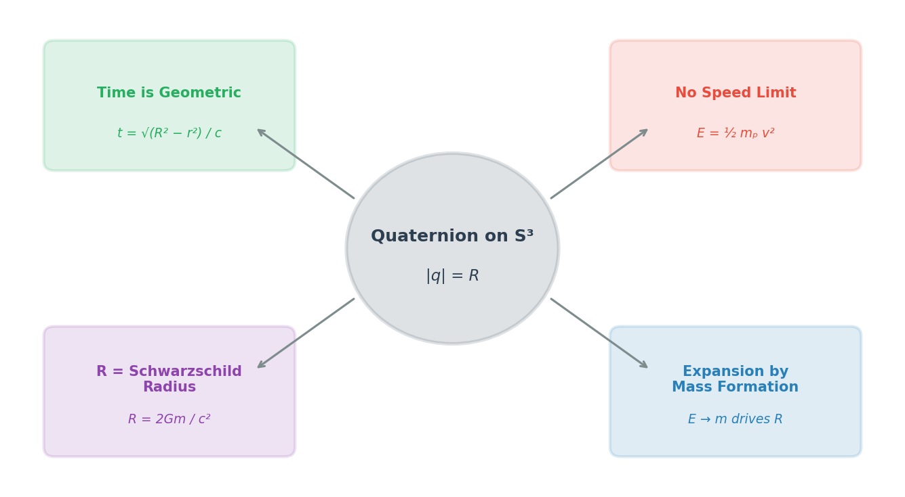

# Spacetime Theory

### *Empathy with the Universe*

by *Norbert Nopper*

- [Quaternion-Hypersphere Theory](README.md)
- [What is Time?](WhatIsTime.md)
- [Faster Than Light](FasterThanLight.md)
- [Outlook](Outlook.md)
- **[Summary](#summary-)**

## Summary 📖

### *The theory at a glance*

## [Quaternion-Hypersphere Theory of Spacetime](README.md)

Spacetime is foliated as $\mathcal{M} = \mathbb{R}_\tau \times S^3_{R(\tau)}$. Each spatial slice is a closed three-sphere of radius $R(\tau)$, parameterized by a unit quaternion $q = \xi + x\mathbf{i} + y\mathbf{j} + z\mathbf{k}$ with $|q| = R$. All four quaternion components are **spatial**. Cosmic time $\tau$ is a separate Lorentzian coordinate with metric $ds^2 = -c^2\, d\tau^2 + ds^2_{S^3_R}$, so Special and General Relativity are built in. The radius equals the Schwarzschild radius of the total mass of the universe, $R = 2Gm/c^2$, and grows monotonically as energy converts to mass via $dR/d\tau = c(1 - R/R_{\max})$, yielding $R(\tau) = R_{\max}(1 - e^{-c\tau/R_{\max}})$.

## [What is Time?](WhatIsTime.md)

Time is the **foliation parameter** $\tau$ — it labels which spatial sphere we are on. Proper time along a worldline follows the standard Lorentzian rule $d\tau_{\text{proper}} = d\tau\sqrt{1 - v^2/c^2}$, reproducing ordinary relativistic time dilation. The fourth quaternion component $\xi = R\cos\chi$ is a *spatial* embedding coordinate, not time. Time is "geometric" in the cosmological sense: without mass there is no spatial sphere, $R(0) = 0$, and nothing to extend in — time emerges together with the material universe.

## [Faster Than Light](FasterThanLight.md)

The speed of light remains a fundamental limit. An earlier version of this theory used a Euclidean signature to argue that the Lorentz factor vanishes and faster-than-light travel is possible; that claim is retracted because a Euclidean bulk contradicts observed time dilation. The Lorentzian signature adopted here restores $\gamma = 1/\sqrt{1-v^2/c^2}$, the infinite-energy barrier at $v = c$, and ordinary light-cone causality.

## [Outlook](Outlook.md)

The geometric framework and the dynamical law are in place. What remains is empirical confrontation: a quantitative expansion history $R(\tau) = R_{\max}(1 - e^{-c\tau/R_{\max}})$ to compare with ΛCDM distance–redshift data, predicted CMB signatures of closed spatial geometry, and a direct check of the Schwarzschild-radius coincidence against observed mass-energy densities.

## Conclusion

Imagine the universe as the surface of a balloon. As more mass forms, the balloon inflates — that is $R$ growing. Everything you can touch or measure lives on this surface. Cosmic time $\tau$ is the inflation clock: it says which balloon size we are on, not where on the balloon you stand.

Time isn't some mysterious force ticking away in the background. It's the accumulated history of the balloon's inflation. No mass, no balloon, no time.

And the speed of light? It is what it has always been: the universal limit. Einstein's rule carries over unchanged. The balloon inflates monotonically and never deflates, so the arrow of time is built into the cosmology itself — not as an extra postulate, but as a consequence of the one-way conversion of energy into mass.
