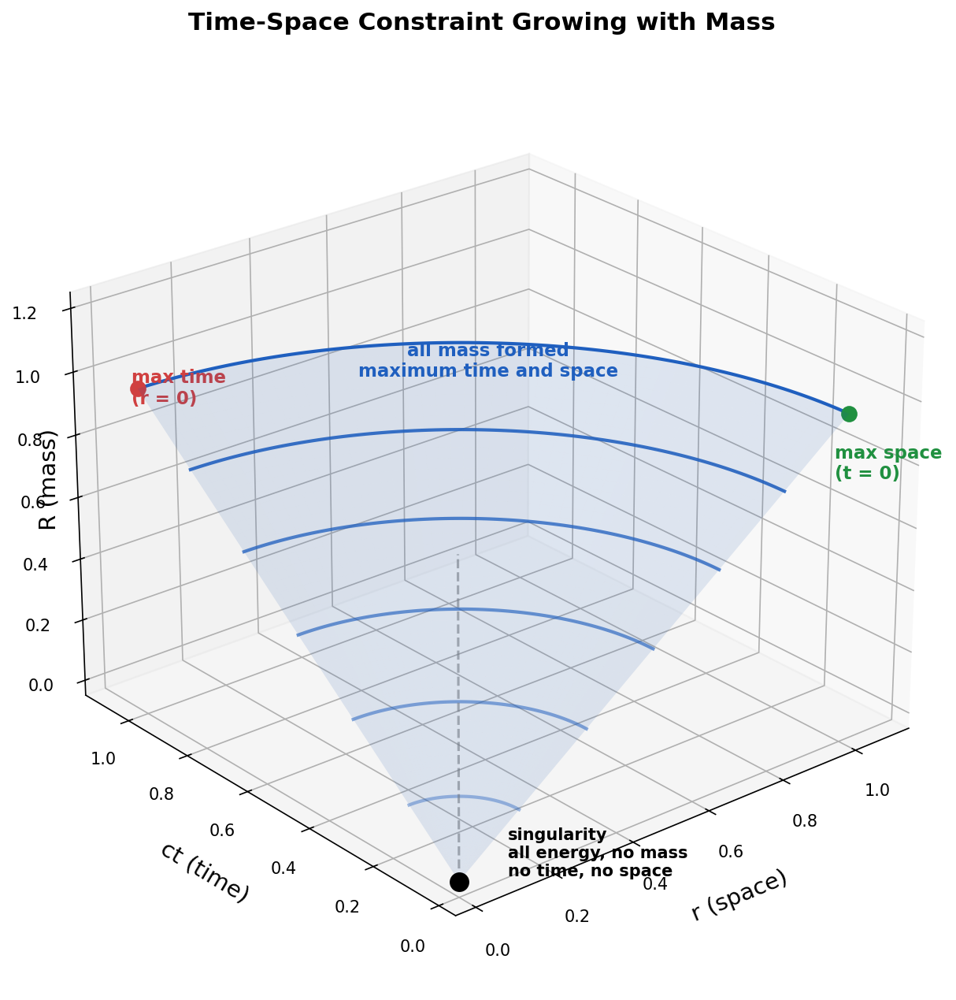

# Spacetime Theory

### *Empathy with the Universe*

by *Norbert Nopper*

- [Quaternion-Hypersphere Theory](README.md)
- **[What is Time?](#what-is-time-)**
- [Faster Than Light](FasterThanLight.md)
- [Outlook](Outlook.md)
- [Summary](Summary.md)

## What is Time? ⏳

### *Time is geometric*

For an observer $\mathcal{O}$ at a point $p_{\mathcal{O}} \in S^3_R$, the **time budget** of an event $q \in S^3_R$ is defined as:

$$t_{\mathcal{O}}(q) = \frac{\sqrt{R^2 - r_{\mathcal{O}}^2(q)}}{c}$$

where

- $c$ is the speed of light
- $r_{\mathcal{O}}(q)$ is the **great-circle arc length** from $p_{\mathcal{O}}$ to $q$ on the current hypersphere $S^3_R$
- $R$ is the radius of the hypersphere $S^3_R$

Time is thus **observer-relative**: different observers on $S^3_R$ assign different $t$ values to the same event, preserving the homogeneity of the hypersphere. This $t$ is a *local, frame-like* quantity distinct from the cosmic epoch $\tau$ (see [Foundations](README.md#foundations)), which orders events across different leaves of the foliation.

## Premise

Every spacetime event is represented as a quaternion $q = ct + x\mathbf{i} + y\mathbf{j} + z\mathbf{k}$ and lies on a hypersphere S³ of radius $R$:

$$|q| = \sqrt{c^2t^2 + x^2 + y^2 + z^2} = R$$

## Constraint

On the hypersphere $S^3_R$, every event satisfies, relative to an observer $\mathcal{O}$:

$$(ct_{\mathcal{O}})^2 + r_{\mathcal{O}}^2 = R^2$$

The left side has two parts — a temporal part $(ct_{\mathcal{O}})^2$ and a spatial part $r_{\mathcal{O}}^2$ — and together they must equal the total radius squared $R^2$. This means time and space are not independent: they share a finite budget set by $R$.

- An event at the observer's own location ($r_{\mathcal{O}} = 0$) has maximum time: $t_{\mathcal{O}} = R/c$
- An event at maximum spatial distance ($r_{\mathcal{O}} = R$, the antipode) has no time: $t_{\mathcal{O}} = 0$
- Everything in between is a trade-off

Because every point on $S^3_R$ is geometrically equivalent, any observer may be taken as origin; the hypersphere itself is homogeneous.

Since $R = \frac{2Gm}{c^2}$, where $G$ is the gravitational constant and $m$ is the total mass of the universe, this budget grows as mass forms:

$$(ct_{\mathcal{O}})^2 + r_{\mathcal{O}}^2 = \left(\frac{2Gm}{c^2}\right)^2$$

More mass means a larger universe — and more room for both time and space.

## Degrees of Freedom

The quaternion constraint $|q| = R$ reduces the four components $(ct, x, y, z)$ to three independent degrees of freedom. A point on $S^3_R$ is specified by three hyperspherical angles $(\chi, \theta, \phi)$ with

$$ct = R\cos\chi, \qquad r = R\sin\chi$$

The component $ct$ is therefore a **position coordinate** on $S^3_R$ — a temporal angle — not an independent clock. The observer-relative time budget $t_{\mathcal{O}}$ above is a *derived* quantity; the cosmic epoch $\tau$ (see [Foundations](README.md#foundations)) is the monotonic clock that orders events across leaves.

## Solving for Time

From the constraint, solving for $t_{\mathcal{O}}$:

$$c^2 t_{\mathcal{O}}^2 = R^2 - r_{\mathcal{O}}^2$$

$$t_{\mathcal{O}} = \frac{\sqrt{R^2 - r_{\mathcal{O}}^2}}{c}$$

Substituting $R = \frac{2Gm}{c^2}$:

$$t_{\mathcal{O}} = \frac{\sqrt{\dfrac{4G^2m^2}{c^4} - r_{\mathcal{O}}^2}}{c}$$

Time is not an independent parameter — it is geometrically determined by the observer's position, the event's position on $S^3_R$, and the total mass of the universe.

## References

- [Gravitational constant](https://en.wikipedia.org/wiki/Gravitational_constant)
- [N-sphere](https://en.wikipedia.org/wiki/N-sphere)
- [Quaternion](https://en.wikipedia.org/wiki/Quaternion)
- [Schwarzschild radius](https://en.wikipedia.org/wiki/Schwarzschild_radius)
- [Speed of light](https://en.wikipedia.org/wiki/Speed_of_light)
- [Time](https://en.wikipedia.org/wiki/Time)
